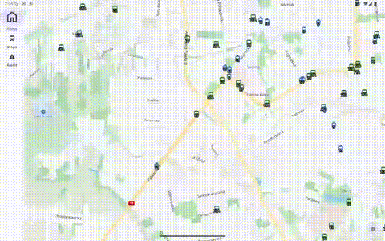

# PublicTransportViewer

Real-time public transport viewer for the city of Lodz, Poland. Displays live
tram and bus positions on a TomTom map, stop departure boards with delay
information, and service alerts.

<p align="center">
  
</p>

## Features

- **Live map** — real-time vehicle positions updated every 5 seconds, rendered
  on TomTom Maps SDK with tram/bus markers and route labels
- **Route overlay** — tap a vehicle to see its full route polyline and stop
  markers on the map
- **Stop departures** — search stops by name and view upcoming departures with
  real-time delay indicators
- **Service alerts** — browse active disruptions with affected routes and
  color-coded severity
- **Current location** — blue dot with recenter button

## Data Sources

All transit data comes from the
[Lodz Open Data portal](https://otwarte.miasto.lodz.pl/):

| Feed | Format | Update frequency |
|------|--------|-----------------|
| Vehicle positions | GTFS Realtime (protobuf) | Polled every 5s |
| Trip updates | GTFS Realtime (protobuf) | Polled every 15s |
| Service alerts | GTFS Realtime (protobuf) | Polled every 60s |
| Schedule data | GTFS Static (CSV in ZIP) | Downloaded on first launch, refreshed weekly |

## Architecture

The app follows MVVM with Jetpack Compose, TomTom Maps SDK for map rendering,
Room for local GTFS storage, and OkHttp for network requests.

See [docs/ARCHITECTURE.md](docs/ARCHITECTURE.md) for the full architecture
documentation including data flow diagrams, database schema, and component
relationships.

## Building

1. Obtain a TomTom API key from [developer.tomtom.com](https://developer.tomtom.com/)
2. Add to `gradle.properties`:
   ```properties
   tomtomApiKey=YOUR_API_KEY
   ```
3. Build and run:
   ```bash
   ./gradlew installDebug
   ```

Requires Android SDK 32+ (Android 12L).
