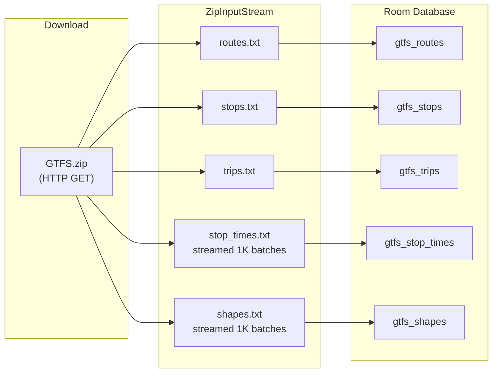
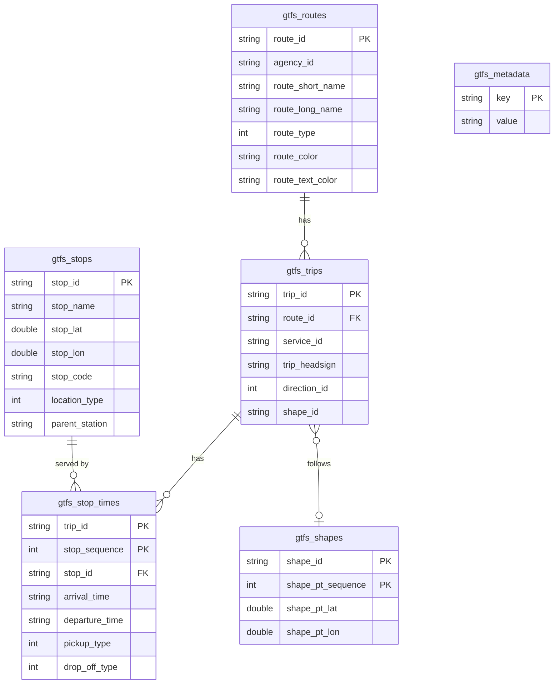
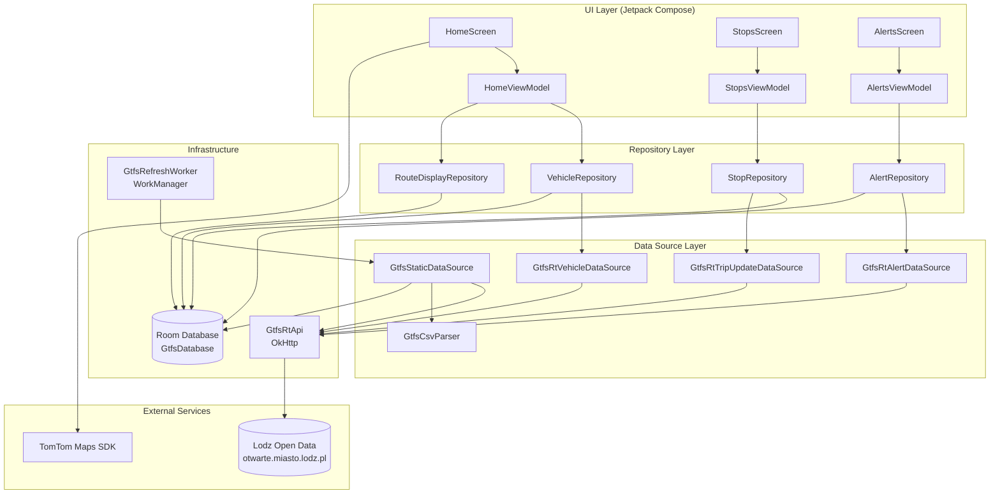
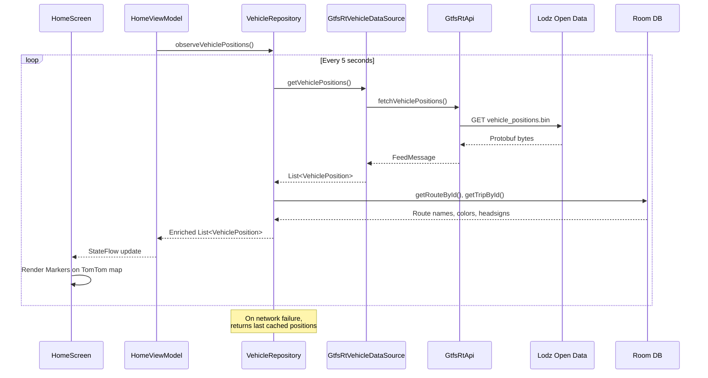
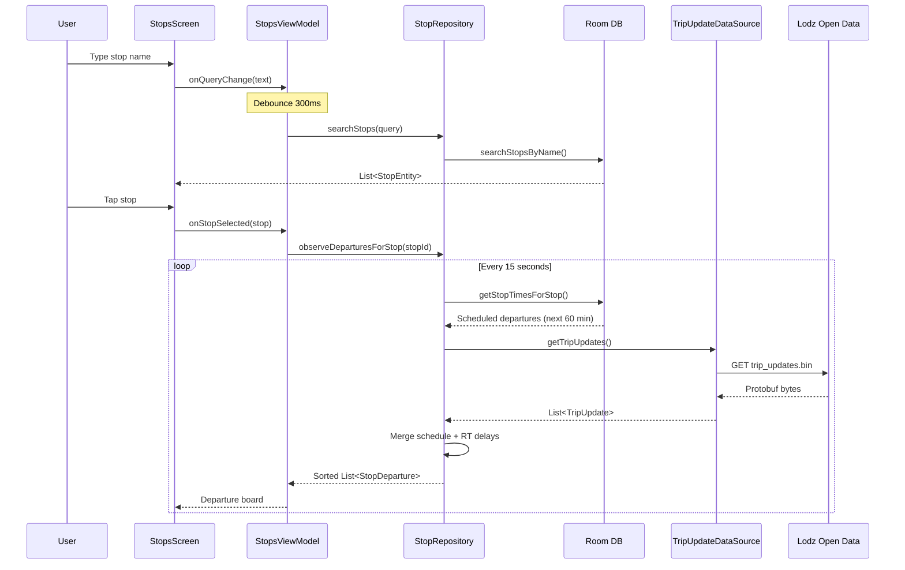
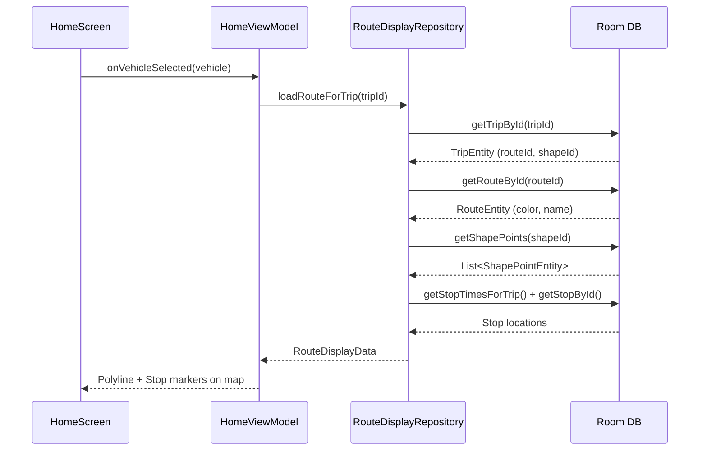
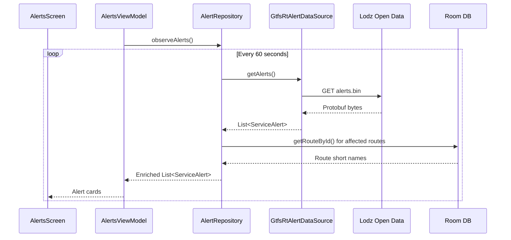
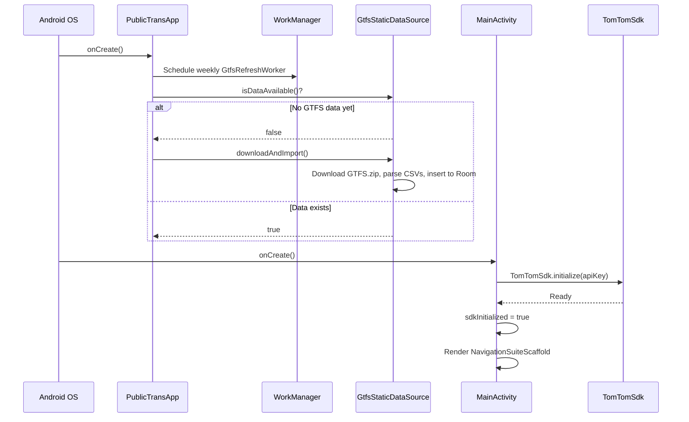
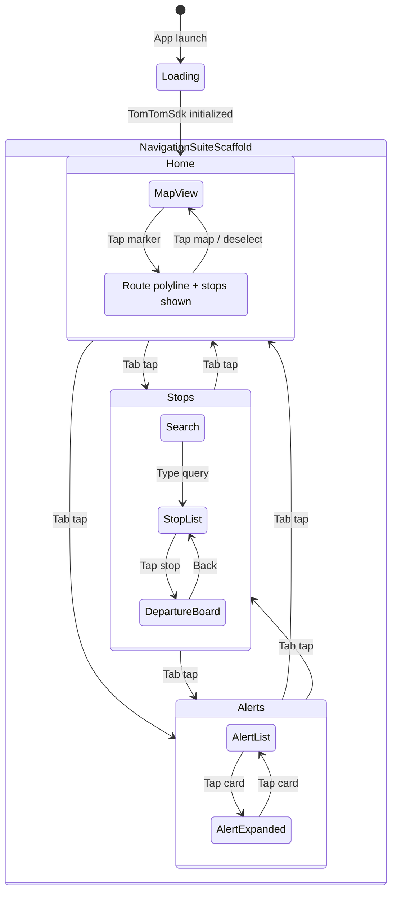

# PublicTransViewer - Architecture Documentation

PublicTransViewer is an Android application that displays real-time public transport
data for the city of Lodz (Poland) on an interactive map. It shows live vehicle
positions (trams and buses), stop departure boards with real-time delays, and
service alerts.

## Map Renderer

The map is rendered using **TomTom Maps SDK for Android v2.2.1**, specifically the
Jetpack Compose integration (`map-display-compose-standard`). The SDK is
initialized in `MainActivity` with an API key provided via the `tomtomApiKey`
Gradle property (injected into `BuildConfig`).

Key TomTom Compose components used:

| Component | Purpose |
|-----------|---------|
| `TomTomMap` | Root composable hosting the map surface |
| `Marker` / `MarkerData` / `MarkerProperties` | Vehicle and stop markers with labels and balloon text |
| `Polyline` / `PolylineData` / `PolylineProperties` | Route shape overlays with color and width-by-zoom |
| `CurrentLocationMarker` / `CurrentLocationMarkerProperties` | Blue dot showing device position |
| `MapLocationInfrastructure` | Connects the TomTom location provider to the map |
| `rememberMapViewState` | Holds camera state, supports `animateCamera()` |

The map is configured in `MapDisplayInfrastructure` which binds `TomTomSdk.sdkContext`
and `TomTomSdk.locationProvider` to the map display.

## Data Sources and Formats

All transit data comes from the **Lodz Open Data portal**
(`otwarte.miasto.lodz.pl`). Two distinct data pipelines feed the app:

### GTFS Static (Schedule Data)

**Format:** Standard GTFS ZIP archive containing CSV text files.
**URL pattern:** `https://otwarte.miasto.lodz.pl/wp-content/uploads/{year}/{month}/GTFS.zip`
**Current:** `2025/06/GTFS.zip`

The ZIP contains these files (parsed by the app):

| File | Contents | Room Table |
|------|----------|------------|
| `routes.txt` | Route definitions (id, short name, type, color) | `gtfs_routes` |
| `stops.txt` | Stop locations (id, name, lat/lon, code) | `gtfs_stops` |
| `trips.txt` | Trip definitions (id, route, headsign, shape) | `gtfs_trips` |
| `stop_times.txt` | Scheduled arrival/departure times per trip+stop | `gtfs_stop_times` |
| `shapes.txt` | Geographic shape points for route polylines | `gtfs_shapes` |

The CSV parsing is handled by `GtfsCsvParser`, which supports:
- Header-based column lookup (column order varies between feeds)
- Quoted field handling
- BOM stripping
- Streaming batch inserts for large files (`stop_times.txt`, `shapes.txt`)
  with 1000-row batches to limit memory pressure

The static data is downloaded on first launch and refreshed weekly via
`GtfsRefreshWorker` (AndroidX WorkManager `PeriodicWorkRequest`).



### GTFS Realtime (Live Data)

**Format:** Protocol Buffer binary, defined by the
[GTFS Realtime specification](https://gtfs.org/realtime/).
**Library:** `org.mobilitydata:gtfs-realtime-bindings:0.0.8`

Three RT feeds are consumed:

| Feed | URL pattern | Polling interval | Purpose |
|------|-------------|-----------------|---------|
| Vehicle Positions | `.../vehicle_positions.bin` | 5 seconds | Live tram/bus locations on the map |
| Trip Updates | `.../trip_updates.bin` | 15 seconds | Real-time arrival/departure delays |
| Service Alerts | `.../alerts.bin` | 60 seconds | Disruption notifications |

Each feed is fetched as raw bytes via OkHttp, then deserialized with
`GtfsRealtime.FeedMessage.parseFrom(bytes)`. The protobuf `FeedMessage`
contains a list of `FeedEntity`, each wrapping either a `VehiclePosition`,
`TripUpdate`, or `Alert` message.

**URL date-path caveat:** The city publishes feeds under a year/month path
(e.g., `2025/06/`). This path changes when feeds are updated. The current
implementation hardcodes `year=2025, month=6` in `GtfsEndpoints`.

## Local Database

**Room v2.8.4** with KSP annotation processing. Database class: `GtfsDatabase`
(version 2, destructive migration enabled).

Six tables store the parsed GTFS static data:

| Table | Entity | Primary Key |
|-------|--------|-------------|
| `gtfs_routes` | `RouteEntity` | `route_id` |
| `gtfs_stops` | `StopEntity` | `stop_id` (indexed on `stop_name`) |
| `gtfs_trips` | `TripEntity` | `trip_id` (indexed on `route_id`) |
| `gtfs_stop_times` | `StopTimeEntity` | (`trip_id`, `stop_sequence`) (indexed on `stop_id`) |
| `gtfs_shapes` | `ShapePointEntity` | (`shape_id`, `shape_pt_sequence`) (indexed on `shape_id`) |
| `gtfs_metadata` | `GtfsMetadataEntity` | `key` (key-value store for download timestamps) |



## Application Architecture

The app follows **MVVM** with a unidirectional data flow. No dependency injection
framework is used; dependencies are wired manually in `PublicTransApp` (the
`Application` subclass) using lazy properties.



### Data Flow: Vehicle Positions



Vehicle type is determined from `route_type` in the static GTFS data (0 = Tram, 3 = Bus);
falls back to a heuristic (route numbers 1-46 = Tram) when static data is unavailable.

### Data Flow: Stop Departures



### Data Flow: Route Display

When a vehicle marker is selected:



### Data Flow: Service Alerts



### App Startup Sequence



## UI Layer

Built entirely with **Jetpack Compose** and **Material 3**.

### Navigation

`NavigationSuiteScaffold` (Material 3 Adaptive) with three destinations:

| Tab | Screen | Icon |
|-----|--------|------|
| Home | `HomeScreen` - Full-screen TomTom map with vehicle markers | `ic_home` |
| Stops | `StopsScreen` - Stop search with departure boards | `ic_bus` |
| Alerts | `AlertsScreen` - Service disruption cards | `ic_alert` |



### Home Screen Features

- Real-time vehicle markers (tram/bus icons with route labels)
- Marker selection shows balloon text with route and headsign
- Selected vehicle displays route polyline and stop markers on the map
- Current location blue dot (`CurrentLocationMarker`)
- Recenter-to-location button (bottom-right `FilledTonalIconButton`)
- Runtime location permission handling via `ActivityResultContracts`
- Location provider lifecycle management (`enable()`/`disable()` in `DisposableEffect`)

### Stops Screen Features

- Text search with 300ms debounce
- Stop list with name and code
- Departure board showing:
  - Route badge (colored by route color)
  - Trip headsign
  - Scheduled time
  - Minutes until arrival
  - Delay indicator (red for late, green for early)

### Alerts Screen Features

- Loading spinner during initial fetch
- Expandable alert cards
- Color-coded effect indicators (NO_SERVICE = red, DETOUR = blue, etc.)
- Route badges for affected routes
- Description text revealed on tap

## Key Dependencies

| Library | Version | Purpose |
|---------|---------|---------|
| TomTom Maps SDK | 2.2.1 | Map rendering, markers, polylines, location |
| Jetpack Compose BOM | 2025.12.00 | UI framework |
| Material 3 | (from BOM) | Design system, adaptive navigation |
| Room | 2.8.4 | Local SQLite database for GTFS static data |
| OkHttp | 4.12.0 | HTTP client for all network requests |
| GTFS RT Bindings | 0.0.8 | Protocol Buffer classes for GTFS Realtime |
| WorkManager | 2.11.0 | Periodic background GTFS refresh |
| KSP | 2.2.10-2.0.2 | Annotation processing for Room |
| Kotlin | 2.2.10 | Language |
| AGP | 9.2.0 | Android build toolchain |

## Build Configuration

- **Min SDK:** 32 (Android 12L)
- **Target/Compile SDK:** 36
- **ABI filters:** `arm64-v8a`, `x86_64`
- **TomTom SDK flavor:** `complete` (via `missingDimensionStrategy`)
- **TomTom API key:** Provided via `gradle.properties` as `tomtomApiKey`,
  injected into `BuildConfig.TOMTOM_API_KEY`

## Project Structure

```
app/src/main/java/com/github/karczews/publictarnsvisualizer/
├── PublicTransApp.kt              # Application class, dependency wiring
├── MainActivity.kt                # TomTom SDK init, navigation scaffold
├── data/
│   ├── db/
│   │   ├── GtfsDatabase.kt        # Room database definition
│   │   ├── dao/                    # Room DAOs (Route, Stop, Trip, StopTime, ShapePoint, Metadata)
│   │   └── entity/                 # Room entities matching GTFS tables
│   ├── model/
│   │   ├── VehiclePosition.kt      # Vehicle with position, route, type, status
│   │   ├── RouteDisplayData.kt     # Route polyline + stops for map overlay
│   │   ├── StopDeparture.kt        # Departure with schedule + real-time delay
│   │   ├── TripUpdate.kt           # Real-time trip delay updates
│   │   └── ServiceAlert.kt         # Alert with cause, effect, affected entities
│   ├── network/
│   │   ├── GtfsEndpoints.kt        # URL construction for all GTFS feeds
│   │   └── GtfsRtApi.kt            # OkHttp-based protobuf feed fetcher
│   ├── repository/
│   │   ├── VehicleRepository.kt     # Polls RT positions, enriches from Room
│   │   ├── RouteDisplayRepository.kt # Loads route shapes and stops for a trip
│   │   ├── StopRepository.kt        # Stop search + departure board with RT delays
│   │   └── AlertRepository.kt       # Polls RT alerts, enriches route names
│   ├── source/
│   │   ├── GtfsRtVehicleDataSource.kt   # Protobuf -> VehiclePosition mapping
│   │   ├── GtfsRtTripUpdateDataSource.kt # Protobuf -> TripUpdate mapping
│   │   ├── GtfsRtAlertDataSource.kt     # Protobuf -> ServiceAlert mapping
│   │   ├── GtfsStaticDataSource.kt      # GTFS ZIP download and Room import
│   │   ├── GtfsCsvParser.kt             # CSV parsing for all GTFS text files
│   │   └── HardcodedVehicleDataSource.kt # Legacy test data source
│   └── worker/
│       └── GtfsRefreshWorker.kt     # Weekly GTFS static data refresh
└── ui/
    ├── home/
    │   ├── HomeScreen.kt            # Map with vehicles, route overlay, location
    │   └── HomeViewModel.kt         # Vehicle polling, route selection
    ├── stops/
    │   ├── StopsScreen.kt           # Search + departure board UI
    │   └── StopsViewModel.kt        # Search debounce, departure polling
    ├── alerts/
    │   ├── AlertsScreen.kt          # Alert cards with expand/collapse
    │   └── AlertsViewModel.kt       # Alert polling
    └── theme/
        ├── Color.kt
        ├── Theme.kt
        └── Type.kt
```
